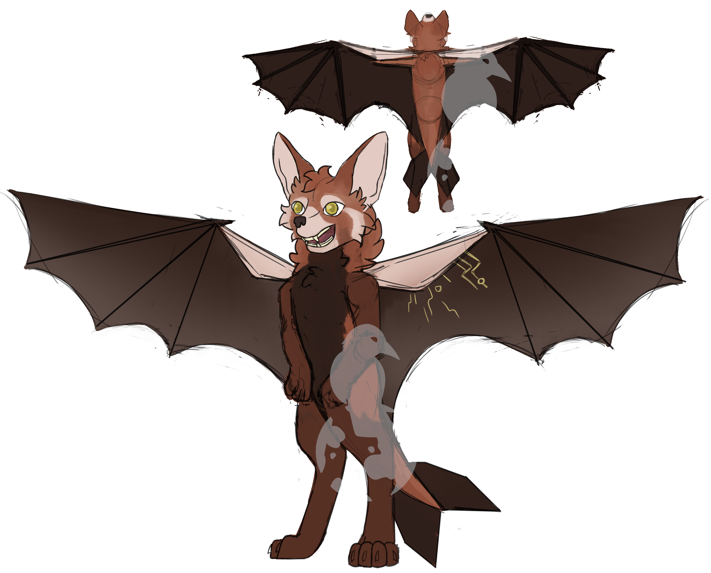

# The Pupuhi-Koi

> [!NOTE]
> The Pupuhi-Koi are a closed species, meaning applications for characters will not be accepted and you are not allowed to use the species to create your own character. Applications applying with Pupuhi-Koi characters will be rejected.

Pupuhi-Koi means "sharp fang" in Maori and is the name of the species of the gods on RavenRock. Every Pupuhi-Koi is a god, though unlike the gods of Greco-Roman cultures, not all gods have aspects. It is common for many minor gods to not have an aspect at all.

Pupuhi-Koi concept art by Cocopet2. Copyright &copy; LuzFaltex 2019. All rights reserved.

## Fun Facts

* Despite having wings, the Pupuhi-Koi are not capable of flight. Instead, they are limited purely to gliding. However, some have learned to use their powers to be able to overcome this limitation.
* Some features, like ear size and fur coloration, vary between individuals.
* They have five fingers, including an opposable thumb
* They are mono-gender. You can read more about reproduction below.

## Anatomy

* Heights: 4'5" - 6'5" (134 - 195cm)
* Weights: 175lbs (80kg) as young adults, up to 275lbs (125kg) as adults
* Lifespans: Unknown, but some individuals have lived thousands of years.
* Reproductive organs: All members of the species are capable of bearing young. This is done using an ovipositor and a pouch.

Most Pupuhi-Koi will express reverse countershading on their coat, meaning they have darker bellies and dual-tone fur. This can vary depending on lineage.

## Courtship

Relationships in Pupuhi-Koi culture have a strong focus on emotional support and trust. Individuals are very close with their partners, and are often not found far from each other. Despite this, there is still a strong focus on the individual as well, because it's recognized that without the individual there would be no relationship. The courtship period varies in duration between individuals, but rushing is frowned upon. This is because, should things work out between the individuals, their souls will need time to prepare for marriage.

Marriage is typically a private event shared only between the two individuals, though not so private that it would not be performed in front of others. It represents a promise between the two individuals to not only trust each other unconditionally but to care for each other until the death of the other.

Marriage vows are spoken in the Pupuhi-Koi's native language and the words themselves are chosen specifically. After speaking the words, it gives their consent for their souls to be divided, half of the soul being given to their partner. The individual must wish to consent and must have their partner in mind at the time, otherwise nothing will happen. These soul halves merge, allowing the partners to remain near each other even when far apart. Emotions and thoughts can be shared across this link, allowing them to continue to innately understand their partner, though they are still safe within their own heads.

Re-marriage is very rare, since this involves dividing the souls once again and returning them to their original owner. Sometimes, re-marriage can happen as a result of one partner dying, however the part of the other person who is with the living individual will continue to live so long as the souls remain joined, so many choose to remain faithful even after they pass.

Marriage itself is rare because of the implications involved. Some individuals will choose a partner, but not soul bond. This is typically done purely for personal reasons. Marriage is never performed for socio-economic, cultural, or any other reason besides the wishes of the partners.

## Reproduction

Every month, all individuals will lay a chicken-sized egg. This egg is comprised of a firm gelatinous substance holding half of the individual's DNA. To reproduce, one partner will take the egg of the other and insert it into their ovipositor. The facilities responsible for creating an egg are activated, and detecting an egg is present, the facilities continue on to the next step, which is to apply the individual's DNA. In an egg with no DNA, this is what provides half of the DNA, making an unfertilized egg. But with with an unfertilized egg in its place, this causes the egg to be fertilized. If both halves of the DNA are from the same individual, the egg will die and it will be resorbed by the body. Otherwise, the egg hardens and travels through the wall of the ovipositor and is deposited in a sealed pouch. Here, the young will grow, consuming the egg in its entirety and living in the pouch for up to twelve months. The resultant child is about the size of a human newborn.

This pouch will remain sealed for the entire duration of the pregnancy. During this time, the young will feed on the egg and then on teets held within the pouch. After twelve months, the top of the pouch will keratinize and the young will nose its way out of the pouch. This is not painful, but does cause itching. It is not uncommon for the parent to assist the newborn in opening the pouch, though this is not required. After birth, the young will remain in the pouch for up to two years longer, though after birth the child may be removed from the pouch freely. This is promoted because it helps with the early development of the child. As the two year mark approaches, the inside of the pouch will become increasingly tender, encouraging the parent to keep the young outside of the pouch for longer periods. During this time, the young will learn to walk and will transition to solid food.

At this time, the pouch itself will reseal, the pouch attaching to itself on the inside and virtually disappearing, which allows the pouch to self-clean and prepare itself for the next reproductive cycle. Once the pouch re-seals, the individual will become fertile again. Twins are not possible with the reproductive organs of the Pupuhi-Koi. One egg will only ever create one child.